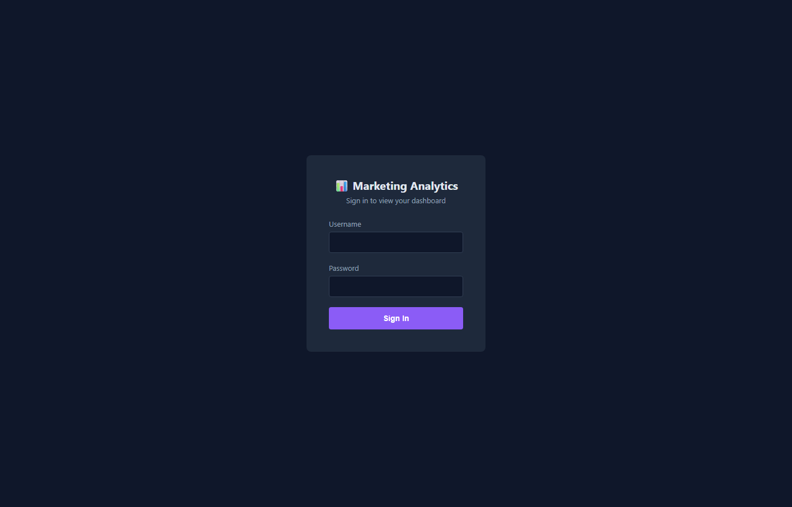
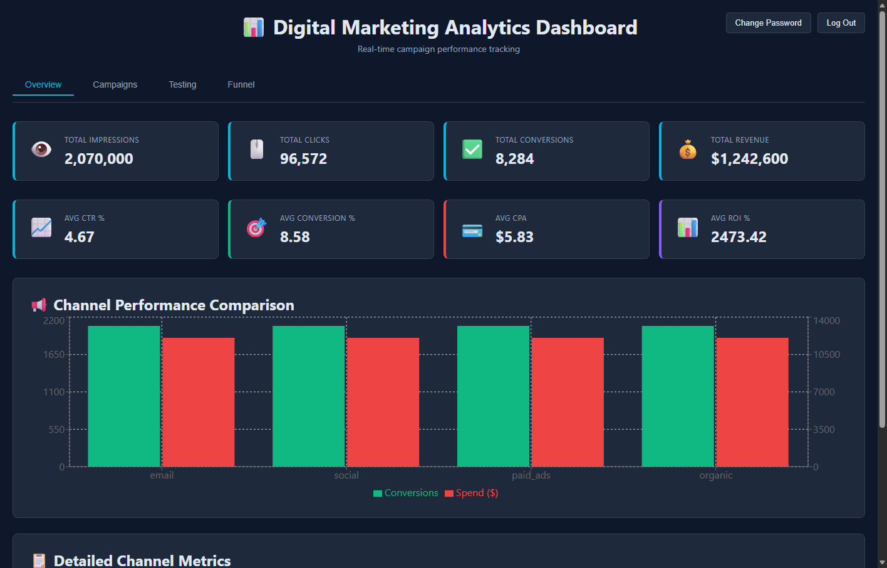

# Digital Marketing Analytics Dashboard

A full-stack analytics dashboard for tracking marketing campaign performance, built with the **FARM stack** (FastAPI, React, MongoDB). Includes authenticated login, KPI tracking, channel performance comparison, A/B test results, and conversion funnel visualization.

## Screenshots

**Login**



**Dashboard**



## Features

- 🔐 **Authentication** — JWT-based login, protected API routes, and self-service password change
- 📊 **KPI overview** — impressions, clicks, conversions, revenue, CTR, conversion rate, CPA, ROI
- 📢 **Channel performance** — compare email, social, paid ads, and organic campaigns
- 📅 **Daily trends** — campaign performance over the last 30 days
- 🧪 **A/B testing** — variant comparison with winner and confidence level
- 🧭 **Conversion funnel** — drop-off analysis from landing page to purchase

## Tech Stack

| Layer     | Technology                          |
|-----------|--------------------------------------|
| Frontend  | React 18, Vite, Recharts             |
| Backend   | FastAPI, Pydantic, python-jose (JWT), passlib (bcrypt) |
| Database  | MongoDB                              |

## Project Structure

```
farm-dashboard/
├── docs/
│   └── screenshots/
└── farm-analytics/
    ├── backend/
    │   ├── farm_analytics_backend.py   # FastAPI app, auth, and analytics routes
    │   ├── requirements.txt
    │   └── Dockerfile
    ├── frontend/
    │   ├── src/
    │   │   ├── main.jsx
    │   │   ├── App.jsx                 # Auth state + routing between Login/Dashboard
    │   │   ├── LoginPage.jsx
    │   │   ├── ChangePasswordModal.jsx
    │   │   └── farm_analytics_frontend.jsx  # Dashboard component
    │   └── package.json
    └── docker-compose.yml
```

## Getting Started

### Prerequisites

- Python 3.11+
- Node.js 18+
- MongoDB running locally (or a connection string to a hosted instance)

### Backend

```bash
cd farm-analytics/backend
python -m venv venv
venv\Scripts\activate        # Windows
# source venv/bin/activate   # macOS/Linux

pip install -r requirements.txt
python farm_analytics_backend.py
```

The API runs at `http://localhost:8000`. Interactive docs at `http://localhost:8000/docs`.

The database connection is controlled by the `MONGO_URL` environment variable (defaults to `mongodb://localhost:27017`).

### Frontend

```bash
cd farm-analytics/frontend
npm install
npm run dev
```

The app runs at `http://localhost:3000` (or the next available port).

### Docker

```bash
cd farm-analytics
docker-compose up --build
```

## Default Login

On first run, a default admin account is seeded automatically:

- **Username:** `admin`
- **Password:** `admin123`

Override these via environment variables before deploying:

```bash
DEFAULT_ADMIN_USERNAME=youradmin
DEFAULT_ADMIN_PASSWORD=your-strong-password
JWT_SECRET_KEY=a-long-random-secret
```

Log in and use **Change Password** from the dashboard header to rotate the password after first login.

## API Endpoints

| Method | Endpoint                  | Auth required | Description                          |
|--------|----------------------------|:--------------:|---------------------------------------|
| POST   | `/auth/login`               | No             | Authenticate and receive a JWT        |
| GET    | `/auth/me`                  | Yes            | Get the current logged-in username    |
| POST   | `/auth/change-password`     | Yes            | Change the current user's password    |
| GET    | `/kpis/summary`             | Yes            | Aggregated KPI totals                 |
| GET    | `/campaigns/summary`        | Yes            | Metrics grouped by channel            |
| GET    | `/campaigns/daily`          | Yes            | Daily campaign metrics (last 30 days) |
| GET    | `/campaigns/{campaign_id}`  | Yes            | Details for a single campaign         |
| GET    | `/ab-tests`                 | Yes            | A/B test results                      |
| GET    | `/funnel`                   | Yes            | Conversion funnel stages              |

## Troubleshooting

**MongoDB connection error?**
```bash
mongod   # ensure MongoDB is running locally
# or set MONGO_URL to point at a remote instance
```

**CORS errors?**
- Backend has CORS enabled for all origins in development
- Confirm the API is reachable at `http://localhost:8000`

**Port conflicts?**
- Change ports in `docker-compose.yml`, `vite.config.js`, or by running uvicorn with `--port`

## License

For educational and internal use.
